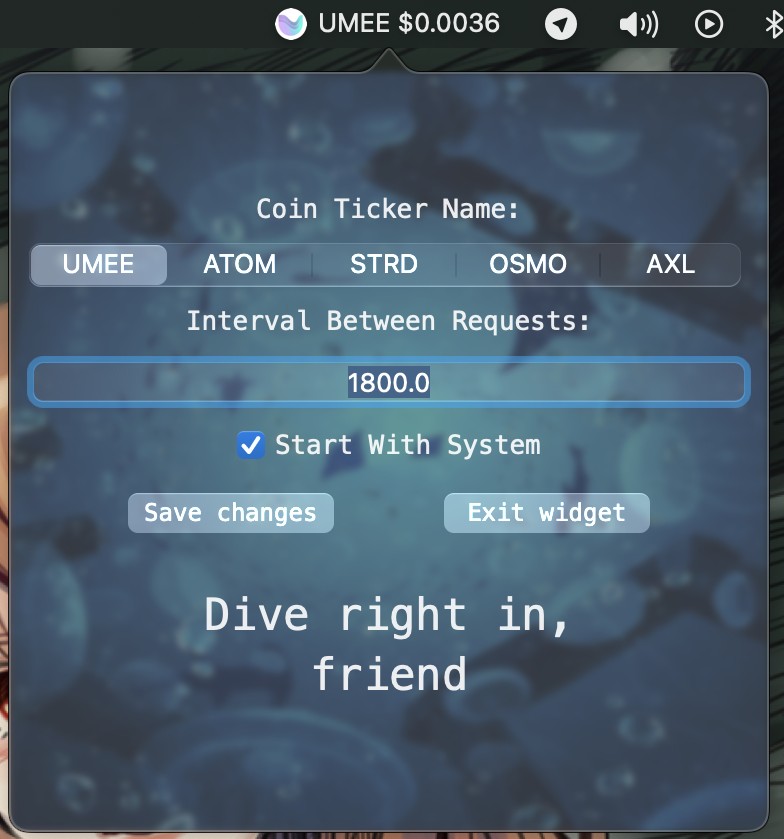

# MacOS Widget for a simple checking of UMEE price

### This mini program written in Swift and uses CoinGecko API for getting prices of:

1) UMEE;
2) ATOM;
3) STRD;
4) OSMO;
5) AXL

### You can select interval of updating and... It's all. Just simple beautiful widget :)

